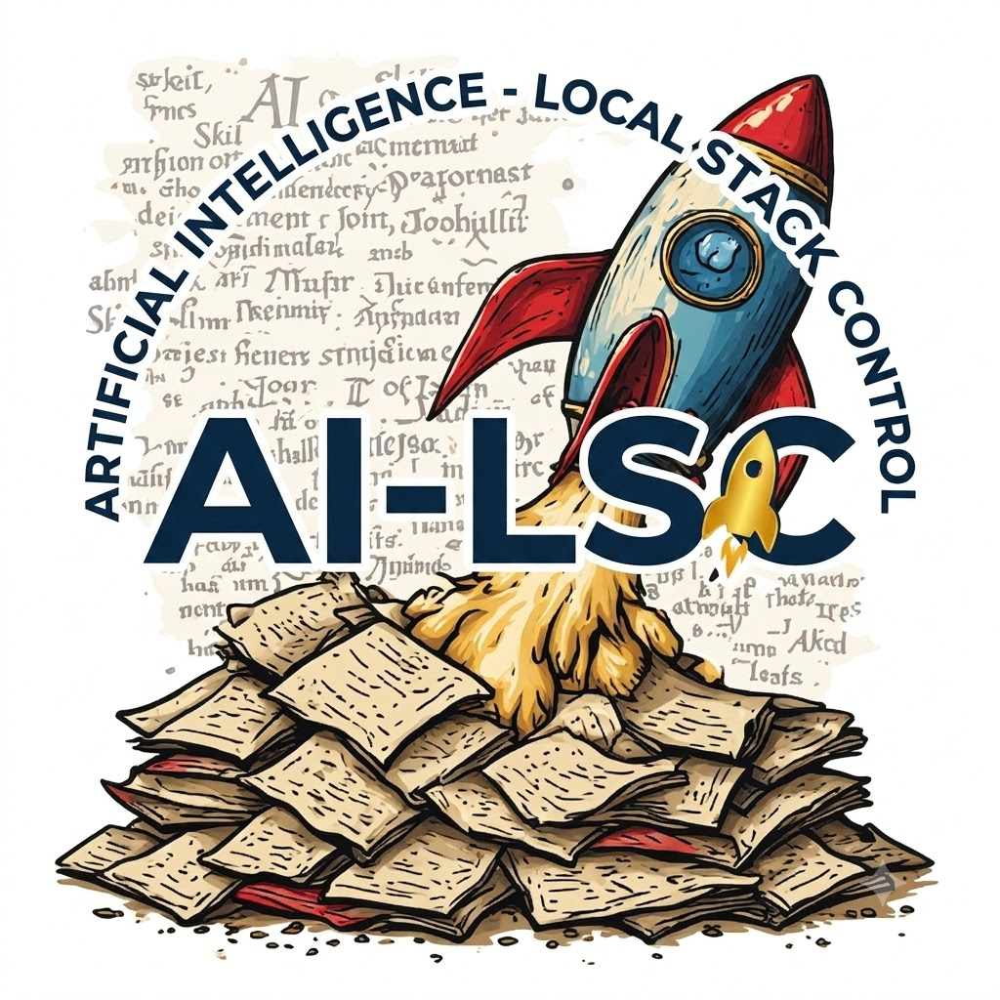

<div align="center">
  
</div>

<h1 align="center">AI - Local Stack Control</h1>

<p align="center">
  <strong>v3.1 — Codename: Ankh of Jah</strong><br>
  <a href="http://dcos.net">http://dcos.net</a>
</p>

<p align="center">
A PySide6 desktop application for orchestrating local AI/ML tool stacks across a 10-layer architecture.
</p>

AI Local Stack Control (AI-LSC) provides a unified interface to discover, configure, launch, and manage 140 tools spanning the entire AI software stack — from GPU runtimes and inference engines to agent frameworks, security tooling, and knowledge management.


## Features

### 10-Layer Infrastructure Architecture

Every tool in the registry is classified within a 10-layer taxonomy, giving you a clear mental model of your entire AI stack. Select tools directly from the sidebar — the sidebar *is* the wizard.

| Layer | Tools | Examples |
|-------|-------|---------|
| L1 — Host Platform | 9 | PostgreSQL, MariaDB, Redis, SQLite3, DuckDB, Podman, Docker, Tmux, Git |
| L2 — Development Environment | 7 | Python Environment, CuPy, ripgrep, fd, tree-sitter, SST, Unsloth |
| L3 — GPU Runtimes | 3 | CUDA Toolkit, NVIDIA Apex, Heretic |
| L4 — Engines | 7 | Ollama, llama.cpp, KoboldCPP, Llamafile, TurboLLM, AirLLM, Locally-Uncensored |
| L5 — Orchestrators | 26 | vLLM, Ray, LiteLLM Proxy, 9Router Proxy, LangChain, LangFlow, Dify, CrewAI, AutoGen, Wayland AI, +17 more |
| L6 — Security | 6 | Keycloak, HashiCorp Vault, Trivy, Fail2Ban, ClamAV, Open Policy Agent |
| L7 — Observability | 8 | Btop, Glances, Prometheus, Grafana, Grafana Alloy, Opik, Pulse AI, Latitude |
| L8 — User Interfaces | 16 | Open WebUI, AnythingLLM, LibreChat, Flowise, InvokeAI, Forge (A1111), ComfyUI, Dashy, Obsidian, +7 more |
| L9 — DevOps | 33 | Terraform, Ansible, Puppet, Pulumi, OpenTofu, AWS CDK, Crossplane, n8n, Aider, Claude Code, OpenHands, +23 more |
| L10 — Knowledge Management | 25 | Zotero, Calibre, Paperless-ngx, Logseq, Joplin, ChromaDB, LanceDB, Qdrant, LlamaIndex, +16 more |


### Sidebar-Integrated Infrastructure Selector

The sidebar doubles as the stack wizard — expand the Infrastructure tree to reveal all 10 layers, each showing its tools with rich-text interface badges (CLI, GUI, Web, Ollama, Docker, MCP, etc.). Toggle checkboxes to stage tools; a debounced compiler (400ms) automatically validates dependencies and writes the compiled pipeline state. No separate popup window needed.

### Stack Editor

Visually compose your tool stack using templates, a two-panel flow builder, and dependency validation. Select from 13 pre-configured stack templates, then customize the wiring topology. Lifecycle engine controls let you start, stop, and monitor services directly from the editor.


### Active Monitor

Stripped to show only active metrics — real-time system health monitoring focused on the services that are actually running. CPU/memory metrics and per-service status indicators for your live stack.


### Pipeline Ticker

A horizontally scrolling status bar at the top of every workspace tab that visualizes the wiring topology of your currently-staged tools in real time. Edges are drawn from the live `STACK_WIRINGS` data: `provider ──interface──▶ consumer`, with arrow color encoding the interface type (blue = openai_api, green = vector, orange = redis_pubsub, purple = postgresql, teal = http_api, etc.). Orphan tools — active but with no wiring to any other active tool — are flagged in red with a warning prefix so you can immediately see disconnected tools. Hover to pause the scroll; click any tool pill to jump to that tool's row.

### Stack Templates

Get started quickly with 13 pre-configured stack templates:

- **Claude Code Setup** — Full Claude Code ecosystem (11 tools)
- **Free Claude Code** — Minimal Claude Code setup (4 tools)
- **SaaS Integrations** — Production deployment stack (12 tools)
- **Local LLM Lab** — Self-hosted LLM playground (10 tools)
- **Agentic OS Stack** — Full agent orchestration stack
- **AI Image Gen Local** — Local image generation pipeline
- **Privacy-First AI Laptop** — Air-gapped AI workstation
- **OpenJarvis Intelligence Stack** — Multi-agent intelligence
- **OpenHands Autonomous Coder** — Autonomous coding agent
- **DeepSeek R1 Local Reasoning** — Local reasoning models
- **Hermes AI Coder Stack** — Hermes-powered coding
- **Aider + Ollama Vibe Coding** — Vibe coding setup
- **Open WebUI Full RAG** — Complete RAG pipeline

### Multi-Backend Container Export

Export your compiled stack to multiple deployment targets:

- **Podman Compose** — Rootless OCI containers via `compose.yaml`
- **Docker Compose** — Standard Docker Compose output
- **LXC Containers** — Per-container `.conf` files + `lxc-launch.sh` lifecycle script
- **Firecracker microVMs** — Per-VM `vm-config.json` files + `firecracker-launch.sh` for ultra-lightweight KVM-backed microVMs


### Runtime Management

Launch and manage tools via four runtime backends, all with shell-injection-safe list-form subprocess calls and validated tool_ids / port ranges:

- **systemd** — Persistent system services with `systemctl` (5 s timeout on `is-active` queries)
- **tmux** — Session-managed terminal processes with user-scoped session names (`ai_lsc_<uid>`)
- **desktop** — One-shot CLI commands
- **lxc** — Full LXC container lifecycle (create, start, stop, freeze, attach) with `shlex.split()` argument preservation and validated container names

All child processes are tracked in a `ProcessManager._launched` list and reaped on application exit so the GUI does not orphan tmux windows or desktop launches.

### Skills System

Extend AI-LSC with skill modules that add specialized behaviors to your tool stack. The Skills Console provides activation toggles, behavior bindings, and runtime integration.


### AI Chat Console

Built-in chat interface for interacting with local LLM endpoints. Supports model selection, conversation history, and direct integration with your running stack.


### DB Manager

Full-screen database management interface for inspecting and querying your stack's data stores. Hides the pipeline ticker to maximize workspace.


### Verification

Validate your compiled stack configuration, check tool dependencies, and verify service connectivity before deployment.


### Settings

Configure base directories, model defaults, API endpoints, logging levels, and application preferences.


## Architecture

```
ai_lsc/
  __init__.py                 # Public API re-exports
  __main__.py                 # Entry point: python -m ai_lsc
  constants.py                # App constants, styles, 10-layer nav order
  types.py                    # Data classes: ToolMetadata, PipelineState, etc.
  guardrails.py               # Import guard for PySide6
  registry/
    __init__.py
    defaults.py                # Master registry (140 tools, full 8-key flags)
    loader.py                  # Merges per-layer files + blacklist enforcement
    manager.py                 # RegistryManager — query/filter/group tools
    validator.py               # Schema validation (8-key flags enforced)
    license_gate.py            # License compliance gating
    licenses.py                # License database
    layers/                    # 10 per-layer tool files
      host_platform.py         # L1: 9 tools
      development.py           # L2: 7 tools
      gpu.py                   # L3: 3 tools
      inference.py             # L4: 7 engines
      orchestrators.py         # L5: 26 tools
      security.py              # L6: 6 tools
      observability.py         # L7: 8 tools
      user_interfaces.py       # L8: 16 tools
      devops.py                # L9: 33 tools
      knowledge_management.py  # L10: 25 tools
    stack_templates/           # 13 pre-configured stack templates
      manager.py               # StackTemplateManager
    openengineer/              # OpenEngineer import pipeline
  runtime/
    __init__.py
    executor.py                # RuntimeExecutor — dispatch + tool_id/port validation
    installer.py               # Tool installation (URL/port/tool_id validation)
    process.py                 # ProcessManager with reap()/shutdown()
    status.py                  # Service status detection
    systemd.py                 # systemd lifecycle (no shell=True)
    tmux.py                    # tmux session mgmt (validated names, XDG sockets)
    lxc.py                     # LXC lifecycle (validated names, shlex.split)
  stack/
    __init__.py
    export.py                  # ContainerBackend — compose/LXC/Firecracker export
    connections.py             # 60-entry STACK_WIRINGS topology (ticker data source)
  ui/
    __init__.py
    protocol.py                # MainWindowProtocol (TYPE_CHECKING-typed)
    main_window.py             # AILocalStackControl — master QMainWindow + sidebar
    dialogs/
      __init__.py
      stack_wizard.py          # Legacy wizard (kept for backward compat)
      license_dialog.py        # License compliance dialog
    pages/
      infrastructure_layer_page.py  # Sidebar-integrated layer checkboxes
      ipc_stack_tab.py              # Stack Editor (templates + flow + lifecycle)
      db_manager.py                 # Full-screen DB management
      chatbot_console.py
      code_analysis_tab.py
      container_stacks_tab.py
      datasets_tab.py
      git_worktree_tab.py
      service_row.py               # Per-layer active service controls
      settings_page.py
      skills_console.py
      tools_tab.py
      verification_tab.py
    widgets/
      __init__.py
      pipeline_ticker.py          # Scrolling wiring-topology status bar
      workspace_tab.py            # Peek-style embedded web + CLI orchestration
  chat/
    __init__.py
    api.py                       # Async chat API worker (sanitized errors)
  agents/
    __init__.py
    orchestrator.py              # Multi-agent orchestration loop
    dispatcher.py                # Agent dispatch
    model_pool.py                # Model pool management
    tool_bridge.py               # Agent ↔ tool registry bridge
    skill_injector.py            # Skill injection into agent context
  skills/
    __init__.py
    resolver.py                  # SkillRuntimeResolver
  manifest/
    __init__.py
    support.py                   # Manifest generation
  utils/
    __init__.py
    filesystem.py                # Path.rglob-based walk_tree
    logging.py
    ollama.py                    # Ollama utilities
    paths.py
    process.py
  service/
    __init__.py
```

## Installation

### Prerequisites

- Python 3.11+
- PySide6 (`pip install PySide6`)
- Arch Linux (pacman) or equivalent package manager

### Quick Install

```bash
git clone https://github.com/your-username/ai-lsc.git
cd ai-lsc
pip install -e .
```

### Bootstrap Script

```bash
./bootstrap.sh
```

The bootstrap script installs all system dependencies (pacman packages), Python dependencies, and verifies your environment.

## Usage

### Launch the Application

```bash
python -m ai_lsc
```

### Typical Workflow

1. **Browse the Infrastructure sidebar** — expand layers to discover and toggle tools (the sidebar is the wizard)
2. **Select a template** from the Stack Editor for a curated starting point, or build from scratch
3. **Validate dependencies** — AI-LSC resolves tool dependencies automatically as you toggle
4. **Compile your stack** — the Stack Editor validates and saves the configuration to `pipeline.json`
5. **Watch the Pipeline Ticker** — the scrolling status bar shows live wiring topology; orphans flagged red
6. **Launch services** — Tools start via systemd, tmux, desktop, or LXC launchers
7. **Orchestrate from Workspace** — every active tool gets its own sub-tab; web tools embed via QWebEngineView, CLI tools attach via tmux
8. **Monitor** — Active metrics dashboard shows real-time status of running tools only
9. **Export** — Generate Podman/Docker Compose, LXC, or Firecracker microVM configs

## Security & Reliability (v3.1)

The v3.1 pass applied a comprehensive security hardening:

- **No `shell=True`** in any subprocess call across `runtime/process.py`, `systemd.py`, `tmux.py`, `lxc.py`, or `installer.py` (15+ sites converted to list-form argv)
- **Registry blacklist enforcement** — the loader strips blacklisted tool IDs (e.g., wayland compositor) at startup, preventing accidental re-introduction
- **Path-traversal protection** at every subprocess boundary: `_validate_tool_id()` rejects `..`, `.`, `/`, and shell metacharacters
- **Port range validation** on every user-supplied port (`1 <= port <= 65535`)
- **URL scheme validation** on every `install_custom` URL (http/https only)
- **Atomic JSON writes** via `tempfile` + `fsync` + `os.replace` with `fcntl.flock` advisory locking
- **Hardened error messages** in the chat API (no internal-detail leakage)
- **Process lifecycle cleanup** on application exit (`ProcessManager.shutdown()`)
- **API keys from environment** — reads from env vars instead of hardcoded values
- **Dynamic Qdrant embedding dimension probe** (no hardcoded dimension mismatch)

## Development

### Project Structure

The project follows a layered architecture with clear separation of concerns:

- **registry/** — Tool definitions, loader, validator, templates, blacklist
- **runtime/** — Process management, launchers, installers
- **stack/** — Container export backends, wiring topology
- **ui/** — PySide6 interface (guarded imports, protocol-based DI, sidebar wizard)
- **chat/** — Async chat API integration
- **agents/** — Multi-agent orchestration, dispatch, model pool
- **skills/** — Skill runtime resolver
- **utils/** — Filesystem, logging, path helpers

### Adding a New Tool

1. Identify the correct layer file in `registry/layers/`
2. Add a new entry to the `TOOLS` dict with the full 8-key flags schema:

```python
'my_tool': {
    "name": "My Tool",
    "layer": "Orchestrators",
    "role": "Hands",
    "category": "Agent Framework",
    "installer": {"type": "npm", "pkg": "my-tool"},
    "launcher": {"type": "tmux", "cmd": "my-tool serve --port {port}",
                  "default_port": 8080},
    "deps": ["ollama"],
    "description": "My awesome AI tool.",
    "flags": {
        "has_cli": True,
        "has_gui": False,
        "has_web": True,
        "is_ollama": False,
        "is_docker": False,
        "is_passive": False,
        "is_mcp": False,
        "is_skills_collection": False,
    },
},
```

3. Run `python -m ai_lsc.registry.validator` to validate the schema
4. Optionally add it to a stack template in `registry/stack_templates/`
5. Optionally add a `STACK_WIRINGS` entry in `stack/connections.py` for Pipeline Ticker visualization

### Creating a Stack Template

```json
{
    "id": "my-template",
    "name": "My Custom Stack",
    "description": "A custom stack for my workflow",
    "version": "1.0",
    "author": "your-name",
    "tags": ["custom", "development"],
    "tools": ["ollama", "aider", "claude_code", "vllm"]
}
```

Save as `registry/stack_templates/my-template.json`.

## Tech Stack

| Component | Technology |
|-----------|-----------|
| UI Framework | PySide6 (Qt for Python) |
| Web Embedding | PySide6 QtWebEngine (servo-swap path documented) |
| CLI Embedding | tmux `capture-pane` polling at 4 Hz |
| Language | Python 3.11+ |
| Package Manager | pip / uv |
| Container Backends | Podman, Docker, LXC, Firecracker microVMs |
| Service Management | systemd, tmux |
| IaC Tools | Terraform, Pulumi, OpenTofu, AWS CDK, Crossplane, Bicep, Terragrunt |
| Config Format | JSON (atomic writes via `tempfile` + `fsync` + `os.replace`) |
| Concurrency | `threading.Lock` for model pool, `fcntl.flock` for cross-process state files |

## License

AGPLv3

## Contributing

1. Fork the repository
2. Create a feature branch (`git checkout -b feature/my-feature`)
3. Add tools to the appropriate layer file
4. Ensure all 10 layer files pass AST validation (`python3 -c "import ast; ..."`)
5. Submit a pull request